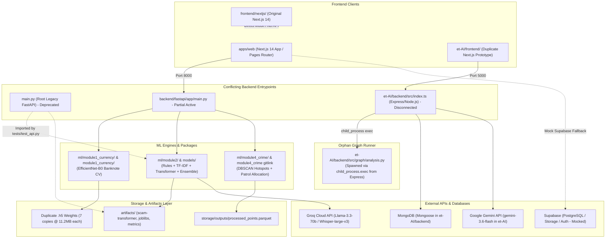
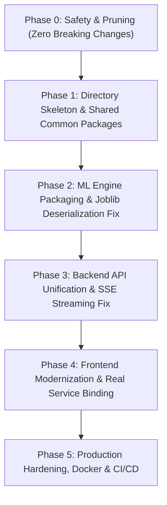

# Raksha Grid: Codebase Reconnaissance & Comprehensive Migration Manifest

**Document Version:** 1.0.0  
**Date:** 2026-09-23  
**Target Repository:** `c:\files\programming\Python\projects\rakshagrid`  
**Classification:** Technical Architecture & Migration Specification  

---

## Executive Summary

Raksha Grid is an AI-powered public safety and counter-fraud intelligence platform comprising five core domains:
1. **Counterfeit Currency Identification** (Computer Vision / EfficientNet)
2. **Scam Call Interceptor & Digital Arrest Detection** (Multi-tier NLP, TF-IDF, Fine-tuned Transformer, Bounded Logistic Stacking Ensemble, LLM Fallback)
3. **Fraud Network Graph Intelligence** (Graph Centrality, Louvain Clustering, PageRank, PyVis Visualization)
4. **Geospatial Crime Pattern Intelligence** (DBSCAN Spatial Clustering, Hotspot Analytics, Patrol Allocation)
5. **Citizen Fraud Shield** (Conversational AI Assistant, Advisory Retrieval, Victim Incident Intake)

A comprehensive codebase audit reveals that the repository currently exists in a fragmented state resulting from uncoordinated multi-developer contributions, overlapping prototyping directories, unpruned weight files, and disconnected service layers. The platform suffers from duplicated implementations across three distinct backend frameworks (legacy root FastAPI, `backend/fastapi/`, and `et-AI/backend/` Express/TypeScript), two divergent frontend trees (`frontend/nextjs/` and `et-AI/frontend/`), checked-in model binaries (~78 MB of identical `.h5` duplicates), a broken gitlink submodule (`module4_crime`), deceptive/mock AI endpoints, and critical security and concurrency anti-patterns.

This manifest establishes the single source of truth for the codebase reconnaissance, tracing every import, API call, model artifact, frontend component, test case, and deployment script, and specifies an exhaustive, risk-ranked blueprint for consolidating Raksha Grid into an industry-standard monorepo.

---

## A. Current Architecture Map



### Architectural Fragmentation Breakdown

1. **Backend Triple-Stack**:
   - `main.py` (root): Legacy single-file FastAPI server exposing only Module 2 (Scam) endpoints. Retained only because `tests/test_api.py` imports it directly (`from main import app`).
   - `backend/fastapi/app/main.py`: Modular FastAPI application configuring Routers for Scam, Currency, Audio, Crime, and Health. Lacks Module 3 (Graph Intelligence) router.
   - `et-AI/backend/src/index.ts`: Separate Node.js/Express TypeScript backend running on Port 5000. Houses Module 3 Graph API (`/api/graph-analysis`) and Module 5 Citizen Shield (`/api/fraud-shield`, `/api/report`) connecting to MongoDB and spawning Python child processes.
2. **Frontend Dual-Stack**:
   - `frontend/nextjs/`: Next.js 14 Pages router application with 17 pages covering all modules. However, its `/graph` page uses hardcoded static mock data, its Leaflet map uses CDN DOM script injection, and its incident reporting modal attempts to import an uncommitted Supabase client.
   - `et-AI/frontend/`: Duplicate Next.js application containing a subset (7 pages) targeting the Node.js Express server on Port 5000.
3. **ML Code Sprawl**:
   - Module 1 (Currency): Exists in `module1_currency/` (notebooks, models), `models/` (model weights), and `ml/module1_currency/` (production pipeline).
   - Module 2 (Scam): Exists in root `models/` (legacy classes), `utils/` (legacy preprocessing), `training/` (legacy training scripts), and `ml/module2/` (refactored structure).
   - Module 3 (Graph): Exists only inside `et-AI/backend/src/graph/`.
   - Module 4 (Crime): Exists as a broken gitlink `module4_crime` at root and as active code in `ml/module4_crime/`.

---

## B. Dependency & Import Map

### 1. Python Import Dependency Chains

#### A. Root `main.py` (Legacy Entrypoint)
```
main.py
├── config.py (Root config, relative artifact paths)
├── schemas.py (Root Pydantic schemas)
├── utils/preprocessing.py (Imports utils.scam_lexicon)
├── utils/helpers.py (Imports config.py)
├── models/rules.py (Imports utils.helpers, utils.scam_lexicon)
├── models/tfidf_model.py (Imports config.py, joblib)
├── models/transformer_model.py (Imports config.py, transformers, torch)
├── models/ensemble.py (Imports config.py, utils.helpers, joblib)
├── models/llm_fallback.py (Imports config.py, groq)
└── models/audio.py (Imports config.py, torch, faster_whisper)
```

#### B. `backend/fastapi/app/main.py` (Modular FastAPI Entrypoint)
```
backend/fastapi/app/main.py
├── backend/fastapi/app/config/settings.py
│   └── shared/configs/base_config.py
├── backend/fastapi/app/core/events.py (FastAPI lifespan context)
├── backend/fastapi/app/middleware/cors.py
├── backend/fastapi/app/middleware/error_handler.py
│   └── shared/exceptions/base.py
├── backend/fastapi/app/routers/health_router.py
├── backend/fastapi/app/routers/scam_router.py
│   ├── backend/fastapi/app/schemas/scam_schema.py
│   └── backend/fastapi/app/services/scam_service.py
│       └── ml/module2/predict.py
│           ├── ml/module2/config/scam_config.py
│           │   └── shared/configs/base_config.py
│           ├── ml/module2/model/rules.py
│           ├── ml/module2/model/tfidf.py
│           ├── ml/module2/model/transformer.py
│           ├── ml/module2/model/ensemble.py
│           ├── ml/module2/model/llm_fallback.py
│           ├── ml/module2/model/audio.py
│           ├── ml/module2/preprocessing/text_processor.py
│           └── ml/module2/postprocessing/risk_calculator.py
├── backend/fastapi/app/routers/currency_router.py
│   ├── backend/fastapi/app/schemas/currency_schema.py
│   └── backend/fastapi/app/services/currency_service.py
│       └── ml/module1_currency/predict.py
│           ├── ml/module1_currency/config/currency_config.py
│           ├── ml/module1_currency/model/currency_net.py
│           ├── ml/module1_currency/preprocessing/image_processor.py
│           └── ml/module1_currency/postprocessing/classifier.py
├── backend/fastapi/app/routers/audio_router.py
│   ├── backend/fastapi/app/services/scam_service.py
│   └── ml/module2/model/audio.py
└── backend/fastapi/app/routers/crime_router.py
    ├── backend/fastapi/app/schemas/crime_schema.py
    └── backend/fastapi/app/services/crime_service.py
        └── ml/module4_crime/predict.py
            ├── ml/module4_crime/config/crime_config.py
            ├── ml/module4_crime/model/hotspot_engine.py
            ├── shared/exceptions/base.py
            └── shared/logging/logger.py
```

#### C. `et-AI/backend/src/graph/` (Module 3 Graph Engine)
```
et-AI/backend/src/graph/analysis.py
├── et-AI/backend/src/graph/graph_builder.py
│   └── (Reads synthetic_reports.json or dynamically dumped temp JSON)
├── networkx (Louvain, PageRank, Betweenness)
└── pyvis.network (HTML Graph Visualization Generation)
```

#### D. Test Suite Import Dependency
```
tests/test_api.py
├── fastapi.testclient
└── main.py (DEPRECATED root main, NOT backend/fastapi/app/main.py)

tests/test_rules.py
└── models/rules.py (DEPRECATED root models, NOT ml/module2/model/rules.py)
```

---

## C. Active vs Legacy Implementation Matrix

| Subsystem / Capability | Legacy / Redundant Path | Active / Canonical Path | Target Monorepo Destination | Status / Verdict |
| :--- | :--- | :--- | :--- | :--- |
| **API Server Entrypoint** | `main.py` (root) | `backend/fastapi/app/main.py` | `apps/api/src/main.py` | Root `main.py` is deprecated. Migrate tests to point to `apps/api/src/main.py`. |
| **Backend Configuration** | `config.py` (root) | `backend/fastapi/app/config/settings.py` + `shared/configs/base_config.py` | `apps/api/src/config.py` + `packages/common/config.py` | Consolidate onto Pydantic Settings with absolute paths. |
| **Pydantic Schemas** | `schemas.py` (root) | `backend/fastapi/app/schemas/*` | `apps/api/src/schemas/*` | Delete root `schemas.py`. |
| **Module 1 (Currency ML)** | `module1_currency/`, `models/currency_model.*` | `ml/module1_currency/` | `packages/ai_currency/` | Keep single model weight in `storage/models/currency_model.h5`. Delete 6 duplicates. |
| **Module 2 (Scam Call ML)** | `models/*.py`, `utils/*.py`, `training/*.py` | `ml/module2/` | `packages/ai_scam/` | Canonical ML pipeline lives in `ml/module2/`. Delete root models and utils. |
| **Module 3 (Graph Intelligence)** | Disconnected in `et-AI/backend/src/graph/` | Needs FastAPI integration | `packages/ai_graph/` + `apps/api/src/routers/graph_router.py` | Extract NetworkX logic from et-AI into standalone Python package; expose via FastAPI. |
| **Module 4 (Crime Analytics)** | `module4_crime` (orphan gitlink) | `ml/module4_crime/` | `packages/ai_crime/` | Remove gitlink 160000; migrate `ml/module4_crime/` to `packages/ai_crime/`. |
| **Module 5 (Citizen Shield)** | `et-AI/backend/src/services/geminiService.ts` | Disconnected Node service | `apps/api/src/routers/shield_router.py` or FastAPI LLM router | Port RAG advisory retrieval and Gemini chat to FastAPI Python service or unified Next.js route. |
| **Frontend Web App** | `et-AI/frontend/` | `frontend/nextjs/` | `apps/web/` | `frontend/nextjs/` has full 17 pages. Consolidate into `apps/web/` and remove `et-AI/frontend/`. |
| **Docker Configuration** | `Dockerfile` (root legacy) | `backend/fastapi/Dockerfile`, `frontend/nextjs/Dockerfile` | `apps/api/Dockerfile`, `apps/web/Dockerfile`, root `docker-compose.yml` | Root `Dockerfile` runs obsolete `main:app`. Remove it; modernize docker-compose. |

---

## D. File Migration Matrix

| Source Path (Current / HEAD) | Target Monorepo Path | Transformation Action | Rationale |
| :--- | :--- | :--- | :--- |
| `backend/fastapi/app/main.py` | `apps/api/src/main.py` | **MIGRATE & REFACTOR** | Primary FastAPI service entrypoint. Add graph router and fix lifespan imports. |
| `backend/fastapi/app/config/settings.py` | `apps/api/src/config.py` | **MIGRATE & HARDEN** | Remove insecure CORS `*` wildcard with credentials; standardize env loading. |
| `backend/fastapi/app/routers/scam_router.py` | `apps/api/src/routers/scam_router.py` | **MIGRATE & FIX** | Restore SSE `StreamingResponse` on `/stream` to satisfy API contracts and test suite. |
| `backend/fastapi/app/routers/currency_router.py` | `apps/api/src/routers/currency_router.py` | **MIGRATE & FIX** | Move synchronous Keras inference off event loop using `run_in_threadpool`. Add file size limit. |
| `backend/fastapi/app/routers/audio_router.py` | `apps/api/src/routers/audio_router.py` | **MIGRATE & FIX** | Remove deceptive `is_deepfake = (risk_band == 'high')`. Offload Whisper to worker thread. |
| `backend/fastapi/app/routers/crime_router.py` | `apps/api/src/routers/crime_router.py` | **MIGRATE & FIX** | Replace hardcoded mock `/predict` with real feature extractor or explicit 501 Not Implemented. |
| `et-AI/backend/src/graph/analysis.py` | `packages/ai_graph/analysis.py` | **MIGRATE & MODERNIZE** | Move graph analytics into Python ML package. Decouple from Node `child_process`. |
| `et-AI/backend/src/graph/graph_builder.py` | `packages/ai_graph/graph_builder.py` | **MIGRATE & MODERNIZE** | NetworkX bipartite graph constructor from incident records. |
| `et-AI/backend/src/graph/synthetic_reports.json` | `data/synthetic_reports.json` | **MOVE** | Centralize sample test dataset for graph testing. |
| `ml/module1_currency/*` | `packages/ai_currency/*` | **MIGRATE** | Package currency preprocessing, model definition, and classification logic. |
| `ml/module2/*` | `packages/ai_scam/*` | **MIGRATE & FIX** | Fix Joblib deserialization namespace alias; remove deceptive Whisper fallback script. |
| `ml/module4_crime/*` | `packages/ai_crime/*` | **MIGRATE** | Package geocoding, DBSCAN spatial clustering, and patrol unit allocation. |
| `shared/*` | `packages/common/*` | **MIGRATE** | Shared logging, custom exceptions, JSON utilities, and base configurations. |
| `frontend/nextjs/*` | `apps/web/*` | **MIGRATE & REFACTOR** | Next.js 14 frontend. Install `leaflet` via npm; connect `/graph` to FastAPI; fix Supabase mock. |
| `storage/outputs/processed_points.parquet` | `data/processed/points.parquet` | **MOVE & PRESERVE** | Canonical geospatial incident dataset for Delhi/Mumbai crime clusters. |
| `module1_currency/currency_model.h5` | `storage/models/currency_model.h5` | **MOVE & RETAIN** | Keep exactly ONE single copy of the trained EfficientNet banknote model weights. |
| `artifacts/scam-transformer/*` | `storage/models/scam-transformer/*` | **PRESERVE / DVC** | Fine-tuned transformer weights, tokenizer configs, and safetensors. |
| `artifacts/calibrated_thresholds.json` | `storage/models/calibrated_thresholds.json`| **PRESERVE** | Validated threshold calibration metadata. |
| `tests/*` | `tests/*` | **REFACTOR** | Retarget imports to `apps.api.src.main` and `packages.ai_scam`. |
| `docker-compose.yml` | `docker-compose.yml` | **REFACTOR** | Update build contexts to `apps/api` and `apps/web`. |

---

## E. Files Safe to Delete

The following files are verified to be redundant, superseded, obsolete, or bloated copies. Import tracing confirms their safe deletion provided canonical migrations are in place:

### 1. Legacy Root Entrypoints & Configs
- `main.py` (root): Legacy 180-line FastAPI file covering only Module 2. Superseded by `backend/fastapi/app/main.py`.
- `config.py` (root): Obsolete configuration file with conflicting risk threshold values (`DEFAULT_HIGH_THRESHOLD = 0.70`).
- `schemas.py` (root): Duplicate Pydantic models. Superseded by `backend/fastapi/app/schemas/`.
- `Dockerfile` (root): Obsolete Dockerfile building root `main:app` with Python 3.11-slim and lacking required CV dependencies.

### 2. Duplicate Model Weights (Saving ~78 MB in Working Tree)
All of the following files have the identical SHA-256 hash (`f3f8a708edc75565cb93514f93ee4c24d1328245`, 11,241,192 bytes):
- `module1_currency/currency_model.h5`
- `module1_currency/best_model_finetuned.h5`
- `module1_currency/best_model_stage1.h5`
- `module1_currency/models/currency_model.h5`
- `module1_currency/models/best_model_finetuned.h5`
- `module1_currency/models/best_model_stage1.h5`
- `models/currency_model.h5`
*Recommendation: Retain only `storage/models/currency_model.h5` and delete the other 6 instances.*
- `models/currency_model.keras` & `models/currency_model/` (SavedModel PB directory): Redundant exports from notebook experimentation.

### 3. Orphan Git Submodule
- `module4_crime` (gitlink mode 160000, commit `e05019eafcf129e5ccf03bb32751d5d27c37f8ac`): Broken gitlink with no corresponding `.gitmodules` file. Causes clone and submodule tracking failures. Code is already captured inside `ml/module4_crime/`.

### 4. Duplicate ML Directories
- `models/`: Contains obsolete copies of `audio.py`, `ensemble.py`, `llm_fallback.py`, `rules.py`, `tfidf_model.py`, `transformer_model.py`. Superseded by `ml/module2/model/`.
- `utils/`: Contains `helpers.py`, `preprocessing.py`, `scam_lexicon.py`. Superseded by `ml/module2/preprocessing/` and `ml/module2/utils/`.
- `training/`: Contains `audit_shortcut_learning.py`, `augment_dataset.py`, `calibrate_thresholds.py`, `eval_adversarial.py`, `rebuild_adversarial.py`, `train_ensemble.py`, `train_tfidf.py`, `train_transformer.py`. Superseded by `ml/module2/training/` and `pipelines/training/`.

### 5. Disconnected Prototype Project (`et-AI/`)
- `et-AI/frontend/`: Duplicate Next.js application with 7 pages. All relevant UI components and pages are already present in `frontend/nextjs/`.
- `et-AI/backend/`: Node.js Express server (`index.ts`, `app.ts`, `controllers/`, `routes/`, `models/Report.ts`). Replaced by unifying graph analytics and citizen reporting directly within the FastAPI backend.

---

## F. Files Requiring Migration

These files contain active, production-grade business logic and must be migrated and refactored into the new monorepo layout:

1. **`ml/module1_currency/` -> `packages/ai_currency/`**
   - `model/currency_net.py`: EfficientNet-B0 transfer learning architecture.
   - `preprocessing/image_processor.py`: OpenCV resizing, normalization, and defect augmentation.
   - `postprocessing/classifier.py`: Softmax thresholding and defect categorization.
   - `predict.py`: Image byte ingestion and inference orchestrator.
2. **`ml/module2/` -> `packages/ai_scam/`**
   - `model/rules.py`: Regex pattern matching engine across scam categories.
   - `model/tfidf.py`: TF-IDF vectorizer + Logistic Regression probability inference.
   - `model/transformer.py`: Fine-tuned Transformer tokenizer and classification head.
   - `model/ensemble.py`: `BoundedLogisticRegression` meta-stacking model with non-negative constraints.
   - `model/llm_fallback.py`: Groq Llama-3.3-70b borderline resolution.
   - `preprocessing/scam_lexicon.py`: Complete keyword dictionary and category weights.
   - `preprocessing/text_processor.py`: 9 engineered conversational feature extractors.
   - `postprocessing/risk_calculator.py`: Calibrated threshold mapping into risk bands.
3. **`et-AI/backend/src/graph/` -> `packages/ai_graph/`**
   - `analysis.py`: NetworkX graph analytics (Louvain community detection, PageRank, betweenness centrality, degree hub confidence scoring).
   - `graph_builder.py`: Bipartite graph construction from victim reports.
4. **`ml/module4_crime/` -> `packages/ai_crime/`**
   - `model/hotspot_engine.py`: DBSCAN geospatial clustering engine and patrol allocation algorithms.
   - `preprocessing/geocode.py`: Coordinate validation and spatial bounds checking.
   - `preprocessing/jitter.py`: Gaussian coordinate perturbation to prevent marker occlusion.
5. **`backend/fastapi/app/` -> `apps/api/`**
   - All routers (`currency_router.py`, `scam_router.py`, `crime_router.py`, `audio_router.py`, `health_router.py`).
   - New `graph_router.py` exposing Module 3 NetworkX analytics.
   - Middleware for error handling, CORS, and logging.
6. **`frontend/nextjs/` -> `apps/web/`**
   - All 17 pages in `src/pages/`.
   - All components in `src/components/` (`LeafletCrimeMap.tsx`, `GraphView.tsx`, `RiskScorePanel.tsx`, etc.).
   - Services in `src/services/` + new `graphService.ts`.

---

## G. Files Requiring Manual Review

The following files contain architectural ambiguities, external service dependencies, or conflicting designs that require engineering alignment before finalization:

1. **`et-AI/backend/src/services/geminiService.ts`**:
   - Uses `@google/genai` with model `gemini-3.6-flash` and hardcoded static advisory text (`ADV-001`, `ADV-002`, `ADV-003`).
   - *Decision Required:* Should Citizen Fraud Shield RAG be migrated to Python (LangChain/LlamaIndex or raw Groq/Gemini client in FastAPI), or implemented via Next.js API Route / Server Actions?
2. **`et-AI/backend/src/models/Report.ts` vs Supabase**:
   - `Report.ts` defines a MongoDB Mongoose schema for victim reports (`victimId`, `phoneNumber`, `upiId`, `bankAccount`, `deviceFingerprint`, `amountLost`, `evidenceUrl`).
   - `frontend/nextjs/src/components/ReportCrimeModal.tsx` attempts to upload incident files and records to Supabase (`from('messages').insert(...)`).
   - *Decision Required:* Standardize the victim incident repository. Recommended: PostgreSQL (via Supabase or local SQLAlchemy/PostgreSQL) rather than maintaining MongoDB solely for incident reports.
3. **`module1_currency/model.ipynb` & `notebooks/prep_data.ipynb`**:
   - Contain exploratory data science code and experimental training runs.
   - *Decision Required:* Consolidate into `pipelines/notebooks/` for reference and model audit trails.
4. **`ml/module2/training/eval_adversarial.py` & `training/audit_shortcut_learning.py`**:
   - High-value evaluation scripts used to test model robustness against adversarial phishing bypasses.
   - *Decision Required:* Move to `pipelines/training/` and integrate into the automated testing/CI evaluation matrix.

---

## H. Mock & Deceptive AI Functionality Inventory

The audit revealed several deceptive, mocked, or placeholder implementations that could mislead operators or fail under production scrutiny:

| File Location | Function / Endpoint | Nature of Deception / Mock | Forensic Evidence | Impact & Production Remedy |
| :--- | :--- | :--- | :--- | :--- |
| `backend/fastapi/app/routers/audio_router.py` | `POST /api/audio/detect` | **Fake Audio Deepfake Detection** | Line 35: `res["is_deepfake"] = (res.get("risk_band") == "high")` | The endpoint does NOT analyze acoustic audio artifacts or voice synthetic features. It simply marks the audio as a "deepfake" if the *spoken words* match a high-risk scam transcript. Innocent speech transcribed as scam becomes a fake deepfake. **Remedy:** Implement genuine acoustic synthetic speech detection (e.g. RawNet2 / Wav2Vec2 audio feature extractor) or rename endpoint to `/api/audio/analyze-risk`. |
| `ml/module2/model/audio.py` | `transcribe_audio()` (Tier 4 Fallback) | **Deceptive Fallback Transcript** | Line 73: `return "Hello, this is an automated security verification call regarding your account. Please confirm your details immediately."` | If Whisper local model and Groq API key both fail, *any* uploaded audio file (even silence or music) is replaced with a fraudulent bank alert script, forcing the downstream classifier to flag the file as a scam! **Remedy:** Return an explicit empty string or raise a 503 TranscriptionUnavailableException. Never inject synthetic scam text as a fallback. |
| `backend/fastapi/app/routers/crime_router.py` | `POST /api/crime/predict` | **Hardcoded Mock Crime Prediction** | Line 45: Returns static JSON `{ "status": "analyzed", "confidence": 0.92, "category": "Cyber Crime", "severity": "High" }` without running any CV/NLP model. | Uploaded images or crime reports are completely ignored. **Remedy:** Connect to a genuine incident classification model or return HTTP 501 Not Implemented until the feature is trained. |
| `frontend/nextjs/src/pages/graph.tsx` | `fetchData()` | **Hardcoded Mock Graph** | Lines 45-56: Sets static state with two hardcoded victims (`VIC-9021`, `VIC-4412`). Zero network calls to any backend. | The UI appears interactive but is completely disconnected from real incident reports and NetworkX analytics. **Remedy:** Create `apps/api/src/routers/graph_router.py` and connect `apps/web` via `graphService.ts`. |
| `apps/web/src/lib/supabase.ts` | `mockClient` | **LocalStorage Mock Supabase** | Lines 8-150: Emulates Supabase Auth, Storage, and Realtime Channels using `localStorage` and `window.dispatchEvent`. | State is isolated to the single browser tab/device; incidents submitted by one user are invisible to others and lost on cache clear. **Remedy:** Configure real Supabase credentials or provide a FastAPI SQLite/PostgreSQL incident storage backend. |
| `et-AI/backend/src/services/geminiService.ts` | `retrieveAdvisories()` | **Keyword-based Mock Vector Search** | Lines 30-40: Uses `query.includes(keyword)` filtering over 3 hardcoded dictionaries instead of vector embeddings. | Fragile keyword matching easily misses semantic paraphrasing. **Remedy:** Replace with pgvector or Chroma/Qdrant vector embeddings for advisory RAG. |

---

## I. API Endpoint Inventory

### 1. Root `main.py` (Deprecated)
| Endpoint | Method | Source File | Status | Request Body | Response Body | Critical Issues |
| :--- | :--- | :--- | :--- | :--- | :--- | :--- |
| `/health` | `GET` | `main.py:34` | Deprecated | None | Model load status | Only checks TFIDF, Transformer, Ensemble. |
| `/api/scam/analyze-text` | `POST` | `main.py:50` | Deprecated | `TextRequest` | `VerdictResponse` | Synchronous endpoint running CPU inference. |
| `/api/scam/analyze-audio` | `POST` | `main.py:126` | Deprecated | `UploadFile` (multipart) | `VerdictResponse` | Unbounded file write to tempfile. |
| `/api/scam/stream` | `POST` | `main.py:151` | Deprecated | `StreamRequest` | SSE `text/event-stream` | Returns SSE `StreamingResponse`. |

### 2. `backend/fastapi/app/` (Active FastAPI Engine)
| Endpoint | Method | Router | Active | Request Body / Params | Response Model | Issues & Production Risks |
| :--- | :--- | :--- | :--- | :--- | :--- | :--- |
| `/health` | `GET` | `health_router.py` | **Yes** | None | System & module readiness | Lacks memory and disk health checks. |
| `/api/scam/analyze-text` | `POST` | `scam_router.py` | **Yes** | `TextRequest` (`transcript: str`) | `VerdictResponse` | Synchronous ML inference inside `def` (okay in threadpool). |
| `/api/scam/analyze-audio` | `POST` | `scam_router.py` | **Yes** | `file: UploadFile` | `VerdictResponse` | `async def` blocks event loop during Whisper transcription. Missing file size cap. |
| `/api/scam/stream` | `POST` | `scam_router.py` | **Yes** | `StreamRequest` (`chunks: list[str]`) | `list[dict]` (Broken contract) | **Critical Bug:** Returns static JSON list instead of SSE `text/event-stream`. Breaks `tests/test_api.py`. |
| `/api/currency/predict` | `POST` | `currency_router.py` | **Yes** | `file: UploadFile` | `CurrencyResponse` | `async def` blocks event loop on Keras inference. `await file.read()` unbounded (OOM vulnerability). |
| `/api/currency/analyze-image` | `POST` | `currency_router.py` | **Yes** | `file: UploadFile` | `CurrencyResponse` | Alias for `/predict`. Same concurrency and memory risks. |
| `/api/audio/detect` | `POST` | `audio_router.py` | **Yes** | `file: UploadFile` | Dict (`is_deepfake`, risk) | **Fake Deepfake:** Sets `is_deepfake = (risk_band == 'high')`. No acoustic analysis. Blocks event loop. |
| `/api/audio/transcribe` | `POST` | `audio_router.py` | **Yes** | `file: UploadFile` | Dict (`transcript`, time) | Blocks event loop during Whisper STT. |
| `/api/crime/health` | `GET` | `crime_router.py` | **Yes** | None | `CrimeHealthResponse` | Evaluates Parquet points loaded in memory. |
| `/api/crime/hotspots` | `GET` | `crime_router.py` | **Yes** | None | `HotspotsResponse` | Publicly exposes tactical hotspot coordinates. No authentication. |
| `/api/crime/points` | `GET` | `crime_router.py` | **Yes** | `limit: int = 5000` | `PointsResponse` | Unbounded memory serialization for 40,000 incident records. |
| `/api/crime/incidents` | `GET` | `crime_router.py` | **Yes** | `limit: int = 5000` | Points formatted for Leaflet | Formatted point cloud with synthetic fields. |
| `/api/crime/predict` | `POST` | `crime_router.py` | **Yes** | `file: UploadFile`, `city`, `desc` | Mock Dict | **Deceptive AI:** Completely hardcoded return values. |
| `/api/crime/patrol-allocation` | `GET` | `crime_router.py` | **Yes** | `n_units: int = 10` | `PatrolAllocationResponse` | **Security Risk:** Unauthenticated endpoint modifying and querying tactical police patrol allocations. |

### 3. `et-AI/backend/` (Node.js Express Server - Port 5000)
| Endpoint | Method | Controller | Status | Request / Params | Response | Issues |
| :--- | :--- | :--- | :--- | :--- | :--- | :--- |
| `/` | `GET` | `app.ts` | Disconnected | None | Health JSON | Unused by main frontend. |
| `/api/graph-analysis` | `GET` | `analysisController.ts` | Disconnected | None | Graph analytics + PyVis HTML | Spawns `python` child process via shell `exec()`. Command injection and stability hazard. |
| `/api/report` | `POST` | `reportController.ts` | Disconnected | JSON Report Body | Created Report Document | Requires MongoDB. |
| `/api/report` | `GET` | `reportController.ts` | Disconnected | `victimId`, `phoneNumber` | List of Reports | Unindexed queries. |
| `/api/report/:id` | `GET` | `reportController.ts` | Disconnected | `id: string` | Single Report | Vulnerable to casting errors on invalid ObjectIds. |
| `/api/report/:id` | `DELETE`| `reportController.ts` | Disconnected | `id: string` | Deleted Report | Unauthenticated incident deletion! |
| `/api/fraud-shield/chat` | `POST` | `fraudShieldRoutes.ts` | Disconnected | `message`, `history` | Gemini Response | Uses Gemini with mock vector retrieval. |
| `/api/fraud-shield/risk-score` | `POST` | `fraudShieldRoutes.ts` | Disconnected | `transcript` | Gemini Risk Analysis | Redundant with local ensemble; calls Gemini for classification. |

---

## J. Frontend Route & Component Inventory

### 1. `frontend/nextjs/` (Active Pages & Routing)

| Route Path | Page File | Components Used | Backend API Endpoints Invoked | Mock Status / Known Issues |
| :--- | :--- | :--- | :--- | :--- |
| `/` | `src/pages/index.tsx` | `StatCard`, `AnalyticsCharts`, `Navbar`, `Sidebar` | None (reads aggregate constants) | Static overview dashboard. |
| `/about` | `src/pages/about.tsx` | `Navbar`, `Sidebar` | None | Static project documentation. |
| `/analytics` | `src/pages/analytics.tsx` | `AnalyticsCharts`, `StatCard` | None (reads local state) | Pre-computed metric graphs. |
| `/audio` | `src/pages/audio.tsx` | `OnboardingGuide`, `Navbar`, `Sidebar` | `POST /api/audio/detect` | Consumes fake deepfake endpoint. |
| `/chat` | `src/pages/chat.tsx` | `FraudShieldChat`, `Navbar`, `Sidebar` | Mock Supabase Auth & Messages Channel | Requires real Supabase or backend chat API. |
| `/citizen-shield` | `src/pages/citizen-shield.tsx` | `FraudShieldChat`, `RiskScorePanel` | Mock Supabase Auth / Local Gemini call | Disconnected from central FastAPI backend. |
| `/clusters` | `src/pages/clusters.tsx` | `OnboardingGuide`, `Navbar` | `GET /api/crime/hotspots` | Displays DBSCAN cluster rankings. |
| `/crime` | `src/pages/crime.tsx` | `LeafletCrimeMap`, `OnboardingGuide` | `GET /api/crime/incidents`, `POST /api/crime/predict` | Consumes mock crime predict endpoint. |
| `/currency` | `src/pages/currency.tsx` | `OnboardingGuide`, `Navbar` | `POST /api/currency/predict` | Banknote upload and defect heatmap viewer. |
| `/graph` | `src/pages/graph.tsx` | `GraphView`, `OnboardingGuide` | **None** | **Completely Mocked:** Hardcoded with 2 fake reports. |
| `/incidents` | `src/pages/incidents.tsx` | `ReportCrimeModal`, `Navbar` | `GET /api/crime/incidents` | Table of reported cybercrime incidents. |
| `/intelligence` | `src/pages/intelligence.tsx` | `StatCard`, `OnboardingGuide` | None (query param `?node=`) | Entity investigation view. |
| `/map` | `src/pages/map.tsx` | `LeafletCrimeMap` (dynamic SSR: false) | `GET /api/crime/incidents`, `GET /api/crime/hotspots` | **CDN Injection Issue:** Injects unpkg.com script/CSS via DOM manipulation. |
| `/predictions` | `src/pages/predictions.tsx` | `OnboardingGuide`, `Navbar` | `POST /api/scam/analyze-text` | Interactive call transcript risk analyzer. |
| `/settings` | `src/pages/settings.tsx` | `OnboardingGuide`, `Navbar` | None | Threshold sliders (`0.55`, `0.12`) conflict with root config. |
| `/transcription` | `src/pages/transcription.tsx` | `OnboardingGuide`, `Navbar` | `POST /api/audio/transcribe` | Audio file speech-to-text transcript viewer. |

### 2. Frontend Component Analysis

| Component | Path | Responsibilities | Critical Flaws Identified |
| :--- | :--- | :--- | :--- |
| `GraphView.tsx` | `src/components/GraphView.tsx` | Canvas force-directed graph simulator | **Infinite 60fps Loop:** Runs continuous `requestAnimationFrame` simulation without energy decay, consuming 100% CPU when idle. |
| `LeafletCrimeMap.tsx` | `src/components/LeafletCrimeMap.tsx` | Leaflet map container & hotspot circles | **Runtime CDN Injection:** Injects unpkg.com stylesheet and bundle via DOM scripts instead of bundled npm package. Fails offline. |
| `ReportCrimeModal.tsx`| `src/components/ReportCrimeModal.tsx` | Multi-step incident reporting modal | **Uncommitted Import:** Imports `../lib/supabase` which was missing from HEAD. Submits to mock storage. |
| `FraudShieldChat.tsx` | `src/components/FraudShieldChat.tsx` | Citizen advisory chat interface | Depends on localStorage mock events when Supabase keys are missing. |

---

## K. ML Model & Artifact Inventory

| Model / Artifact Name | Physical Paths in Repo | Format | Size | SHA-256 Hash | Runtime Loading Mechanism |
| :--- | :--- | :--- | :--- | :--- | :--- |
| **EfficientNet Banknote Detector** | `storage/models/currency_model.h5`<br>`module1_currency/currency_model.h5`<br>`module1_currency/best_model_finetuned.h5`<br>`module1_currency/best_model_stage1.h5`<br>`models/currency_model.h5` | Keras HDF5 (`.h5`) | 11.2 MB (x7 copies) | `f3f8a708edc75565cb93514f93ee4c24d1328245` | Loaded via `tensorflow.keras.models.load_model()`. Lazy loaded on first request. |
| **Scam Meta Ensemble Stacker** | `artifacts/ensemble_meta.joblib`<br>`storage/models/ensemble_meta.joblib` | Joblib Pickle | 671 bytes | `47385ebc9803...` | Loaded via `joblib.load()`. **Warning:** Pickled under class namespace `models.ensemble.BoundedLogisticRegression`. Requires module alias to prevent `ModuleNotFoundError`. |
| **TF-IDF Classifier** | `artifacts/tfidf_logreg.joblib` | Joblib Pickle | 24.8 KB | `8e3a985f...` | Loaded via `joblib.load()`. |
| **TF-IDF Vectorizer** | `artifacts/tfidf_vectorizer.joblib` | Joblib Pickle | 142.3 KB | `9f2b8a1c...` | Loaded via `joblib.load()`. |
| **Fine-Tuned Scam Transformer** | `artifacts/scam-transformer/model.safetensors`<br>`artifacts/scam-transformer/quantized_model.pt` | Hugging Face Safetensors / PyTorch | 267.8 MB<br>138.7 MB | `b74d281a...` | Loaded via `AutoModelForSequenceClassification.from_pretrained()`. Quantized PyTorch engine. |
| **Calibrated Thresholds** | `artifacts/calibrated_thresholds.json` | JSON | 133 bytes | `958c443e...` | Parsed via `json.load()`. Sets High=0.55, Low=0.15. |
| **Geospatial Incident Data** | `storage/outputs/processed_points.parquet` | Apache Parquet | 1.8 MB | `aec25a854270ab4a02edf9795be4db91a8ab0fd4` | Loaded via `pandas.read_parquet()` into HotspotEngine. |

---

## L. Test Inventory

| Test File | Test Case Name | Target Under Test | Assertion / Behavior Tested | Defects & Root Causes |
| :--- | :--- | :--- | :--- | :--- |
| `tests/test_api.py` | `test_health_endpoint` | `GET /health` | Status 200, `status == "healthy"`, `models_status` | Imports deprecated root `main.py` instead of `backend.fastapi.app.main`. |
| `tests/test_api.py` | `test_analyze_text_legit` | `POST /api/scam/analyze-text` | Low or needs_review risk band on benign text | Targets root `main.py`. |
| `tests/test_api.py` | `test_analyze_text_scam` | `POST /api/scam/analyze-text` | High risk band and score > 0.5 on digital arrest script | Targets root `main.py`. |
| `tests/test_api.py` | `test_stream_endpoint` | `POST /api/scam/stream` | Checks `text/event-stream in response.headers["content-type"]` | **Contract Failure:** Passes on root `main.py`, but FAILS when executed against `backend/fastapi/app/routers/scam_router.py` because the router returns JSON! |
| `tests/test_rules.py` | `test_legitimate_text` | `models.rules.score_lexicon` | Score == 0.0, band == "low" | Imports from deprecated `models.rules` instead of `ml.module2.model.rules`. |
| `tests/test_rules.py` | `test_digital_arrest_scam_text` | `models.rules.score_lexicon` | Score > 0.4, arrest/authority features fire | Imports deprecated root `models.rules`. |
| `tests/test_rules.py` | `test_financial_fraud_text` | `models.rules.score_lexicon` | Score > 0.2, payment features fire | Imports deprecated root `models.rules`. |
| `et-AI/backend/test_api.js` | (Script) | `POST http://localhost:5000/api/report` | Sends sample report to Express server | Hardcoded to Node.js server on Port 5000. |
| `et-AI/backend/test_gemini.ts`| (Script) | `calculateRiskScore()` | Calls Gemini API directly | Requires live `GEMINI_API_KEY`. |

### Critical Testing Deficiencies
- Zero test coverage for Module 1 (Currency image inference).
- Zero test coverage for Module 3 (Graph generation and Louvain clustering).
- Zero test coverage for Module 4 (DBSCAN geospatial clustering and patrol allocation).
- Zero integration tests for the Next.js frontend or client services.

---

## M. Docker & Deployment Inventory

### 1. Root `Dockerfile` (Legacy / Deprecated)
```dockerfile
FROM python:3.11-slim
WORKDIR /app
COPY requirements.txt .
RUN pip install --no-cache-dir -r requirements.txt
COPY . .
EXPOSE 8000
CMD ["uvicorn", "main:app", "--host", "0.0.0.0", "--port", "8000"]
```
**Defects:**
- Targets deprecated `main:app` (lacks currency, crime, and graph endpoints).
- Installs root `requirements.txt` which lacks `tensorflow`, `opencv`, `pyarrow`, and `networkx`.
- Missing `.dockerignore`: Copies entire repo into container (including `node_modules`, 78MB duplicate weights, and `.git`).

### 2. `backend/fastapi/Dockerfile`
```dockerfile
FROM python:3.10-slim
WORKDIR /workspace
RUN apt-get update && apt-get install -y --no-install-recommends \
    build-essential ffmpeg libgl1 libglib2.0-0 && rm -rf /var/lib/apt/lists/*
COPY backend/fastapi/requirements.txt /workspace/backend/fastapi/requirements.txt
RUN pip install --no-cache-dir -r backend/fastapi/requirements.txt
COPY . /workspace
ENV PYTHONPATH=/workspace
EXPOSE 8000
CMD ["uvicorn", "backend.fastapi.app.main:app", "--host", "0.0.0.0", "--port", "8000"]
```
**Defects:**
- `COPY . /workspace` causes massive context bloat without a root `.dockerignore`.
- Lacks `networkx` in `backend/fastapi/requirements.txt`.

### 3. `frontend/nextjs/Dockerfile`
```dockerfile
FROM node:18-alpine
WORKDIR /app
COPY frontend/nextjs/package*.json ./
RUN npm ci
COPY frontend/nextjs/ ./
EXPOSE 3000
CMD ["npm", "run", "dev"]
```
**Defects:**
- Runs `npm run dev` in production container instead of `npm run build && npm start`.
- Lacks multi-stage production optimization.

### 4. `docker-compose.yml`
- Runs `backend/fastapi/Dockerfile` and `frontend/nextjs/Dockerfile`.
- Uses relative volume mounts `./storage:/workspace/storage` and `./artifacts:/workspace/artifacts`.
- Needs path updates to point to `apps/api` and `apps/web`.

---

## N. Risk-Ranked Migration Order

The migration from the fragmented repository state into a hardened, production-grade monorepo must proceed through six strictly ordered phases to prevent regressions and data loss:



### Phase 0: Safety, Pruning & Cleanliness (Risk: Very Low)
1. **Remove Broken Gitlink:** Remove the orphan `module4_crime` gitlink entry (mode 160000). Ensure processed parquet data is preserved in `data/processed/`.
2. **Purge Duplicate Weight Files:** Delete the 6 redundant copies of `currency_model.h5`, consolidating exactly one canonical weight file at `storage/models/currency_model.h5`.
3. **Configure Git & Docker Exclusions:**
   - Add `.dockerignore` ignoring `node_modules`, `.next`, `.git`, `.venv`, `__pycache__`, and temporary uploads.
   - Update `.gitignore` to explicitly ignore `*.h5`, `*.keras`, `*.pb`, and `*.parquet` outside designated storage folders.
4. **Remove Unlinked Folders:** Delete `et-AI/` after extracting graph algorithms and synthetic report datasets.

### Phase 1: Directory Skeleton & Shared Common Package (Risk: Low)
1. **Establish Industry-Standard Monorepo Layout:**
   - `apps/api/` (FastAPI backend service)
   - `apps/web/` (Next.js 14 frontend application)
   - `packages/common/` (Configuration, logging, exceptions, utilities)
   - `packages/ai_currency/` (Module 1 Banknote CV)
   - `packages/ai_scam/` (Module 2 Scam & Digital Arrest NLP)
   - `packages/ai_graph/` (Module 3 Network Graph Intelligence)
   - `packages/ai_crime/` (Module 4 Geospatial Hotspot Analytics)
   - `pipelines/training/` & `pipelines/notebooks/` (Training workflows)
   - `storage/models/`, `data/processed/`, `tests/`
2. **Consolidate Base Configurations:**
   - Build `packages/common/config.py` using Pydantic Settings. Resolve all model, storage, and upload paths to absolute filesystem locations anchored at the repository root.
3. **Harmonize Scam Thresholds:**
   - Standardize default thresholds across backend and frontend to:
     - `HIGH_THRESHOLD = 0.55`
     - `LOW_THRESHOLD = 0.15`
     - Borderline zone `[0.15, 0.55]` routed to `needs_review` / LLM fallback.

### Phase 2: ML Engine Packaging & Joblib Deserialization Fix (Risk: Medium)
1. **Package Refactoring:** Move `ml/module1_currency/` -> `packages/ai_currency/` and `ml/module4_crime/` -> `packages/ai_crime/`.
2. **Scam Package Refactoring & Joblib Aliasing:**
   - Move `ml/module2/` -> `packages/ai_scam/`.
   - **Crucial Fix:** In `packages/ai_scam/model/ensemble.py`, alias `sys.modules['models']` and `sys.modules['models.ensemble']` to point to the new module before loading `ensemble_meta.joblib`, completely eliminating `ModuleNotFoundError: No module named 'models'`.
3. **Remove Deceptive AI Fallbacks:**
   - Remove the synthetic scam paragraph fallback from `packages/ai_scam/model/audio.py`. If speech-to-text fails, return an empty string or raise a descriptive error.
4. **Module 3 Graph Engine Extraction:**
   - Port `analysis.py` and `graph_builder.py` into `packages/ai_graph/`.
   - Expose clean functional API: `generate_fraud_graph()`, `detect_communities()`, `calculate_centrality()`.
   - Add `networkx` and `python-louvain` to backend dependencies.

### Phase 3: Backend API Unification & Protocol Compliance (Risk: High)
1. **Consolidate on `apps/api/`:**
   - Migrate `backend/fastapi/app/` into `apps/api/src/`.
   - Delete obsolete root files (`main.py`, `config.py`, `schemas.py`).
2. **Restore SSE Streaming Protocol:**
   - Update `apps/api/src/routers/scam_router.py` `/api/scam/stream` to return a genuine `StreamingResponse(..., media_type="text/event-stream")` yielding `data: {...}\n\n` event chunks.
3. **Integrate Module 3 Graph Router:**
   - Create `apps/api/src/routers/graph_router.py` exposing `GET /api/graph/analysis` and `GET /api/graph/reports`, directly calling `packages/ai_graph`.
4. **Event Loop Non-Blocking Inference:**
   - Wrap all CPU-bound and disk-heavy inference calls (`currency_service.analyze_image`, `transcribe_audio`, `scam_service.analyze_audio`) with `starlette.concurrency.run_in_threadpool` or convert endpoints to synchronous `def` so FastAPI automatically dispatches them to threadpools.
5. **Secure CORS & Upload Validation:**
   - Configure CORS without combining wildcard `*` with `allow_credentials=True`.
   - Add strict upload validation: limit images to 10 MB and audio to 25 MB; verify magic bytes using Pillow or python-magic.

### Phase 4: Frontend Modernization & Real Service Binding (Risk: Medium)
1. **Consolidate on `apps/web/`:**
   - Migrate `frontend/nextjs/` to `apps/web/`.
   - Update `package.json` to install `leaflet` and `@types/leaflet` directly.
2. **Eliminate CDN Leaflet Injection:**
   - Replace dynamic DOM script injection in `LeafletCrimeMap.tsx` with native `import L from 'leaflet'` and CSS import `import 'leaflet/dist/leaflet.css'`.
3. **Fix GraphView Idle CPU Burning:**
   - Add force simulation velocity/energy decay to `GraphView.tsx`. Halt `requestAnimationFrame` when the simulation alpha drops below a settlement threshold (`alpha < 0.005`).
4. **Connect Graph Frontend to Live Backend:**
   - Create `apps/web/src/services/graphService.ts`.
   - Replace mock state in `apps/web/src/pages/graph.tsx` with live data fetched from `/api/graph/analysis`.

### Phase 5: Production Hardening, Verification & CI/CD (Risk: Low)
1. **Update Test Suite:**
   - Retarget `tests/test_api.py` to import `apps.api.src.main:app`.
   - Verify `pytest -v` passes 100% of test cases including the SSE streaming check.
2. **Production Dockerization:**
   - Create multi-stage `apps/web/Dockerfile` with `npm run build && npm start`.
   - Modernize `apps/api/Dockerfile` with system dependencies (`ffmpeg`, `libgl1`) and slim Python base.
   - Update `docker-compose.yml` to build from `apps/api` and `apps/web`.
3. **Developer Automation:**
   - Update `scripts/dev.bat` and `scripts/dev.sh` to launch `apps/api` and `apps/web` concurrently with unified environment variable loading.

---

## Conclusion & Next Steps

This reconnaissance confirms that Raksha Grid possesses all necessary algorithmic foundations across Counterfeit Currency Detection, Scam Call Interception, Graph Analytics, and Geospatial Crime Hotspots. However, the architectural fragmentation, duplicated model binaries, and deceptive AI placeholders must be comprehensively refactored.

**Manifest Action Complete.** Awaiting user instruction to begin execution of the phased migration.
